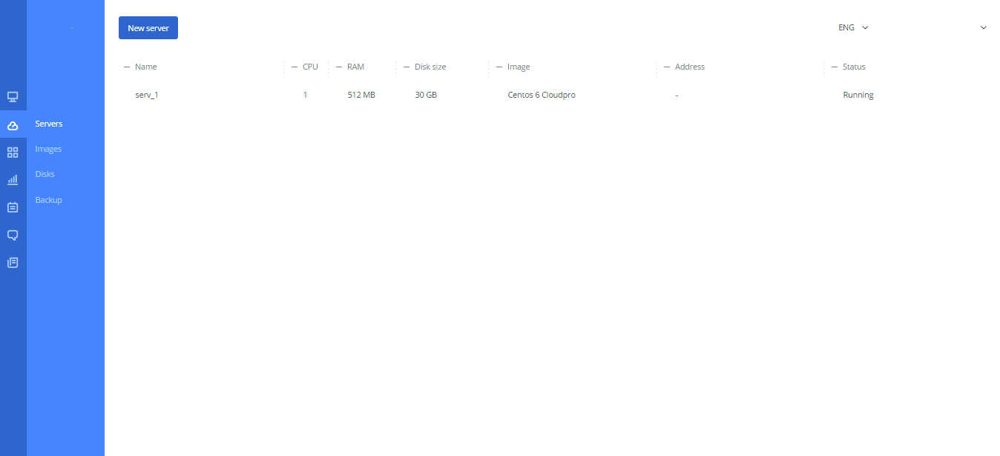
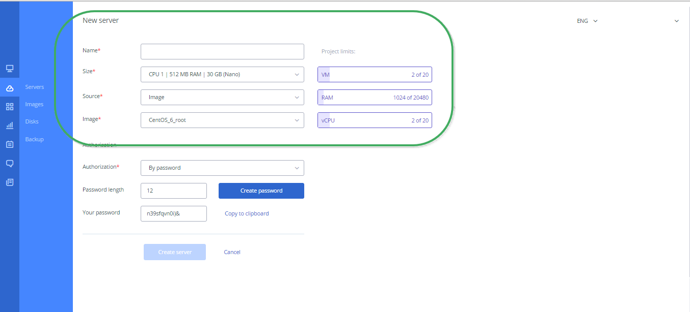
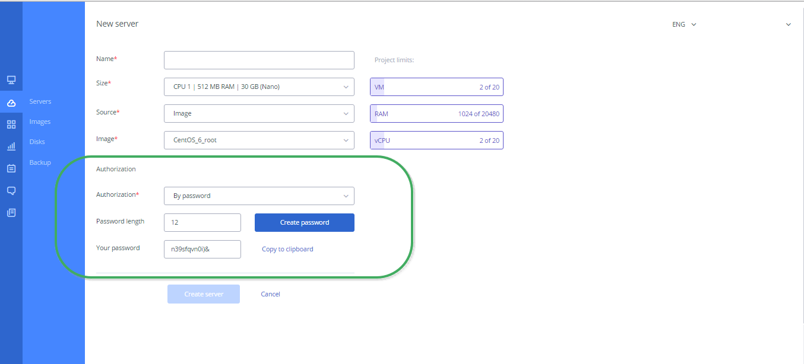
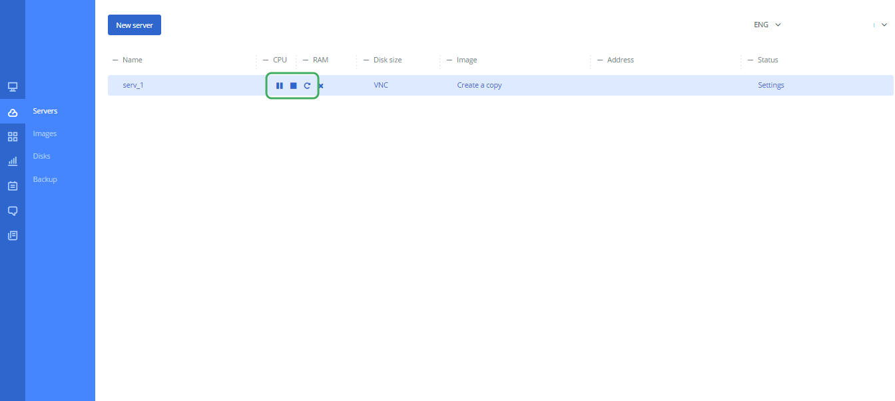
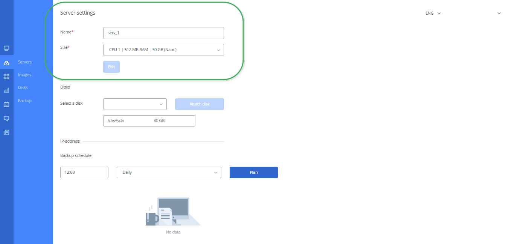
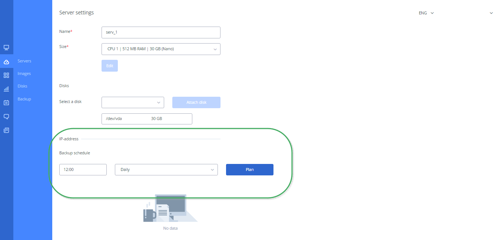
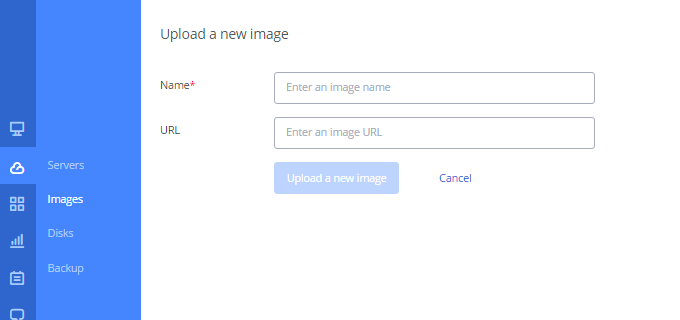
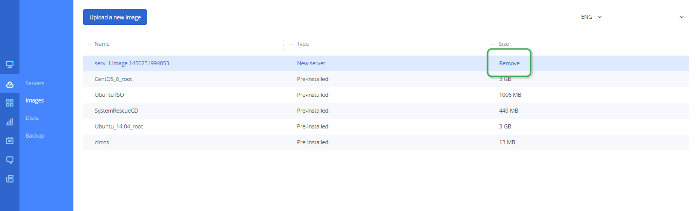
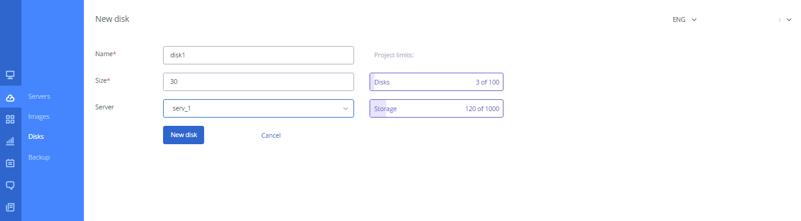
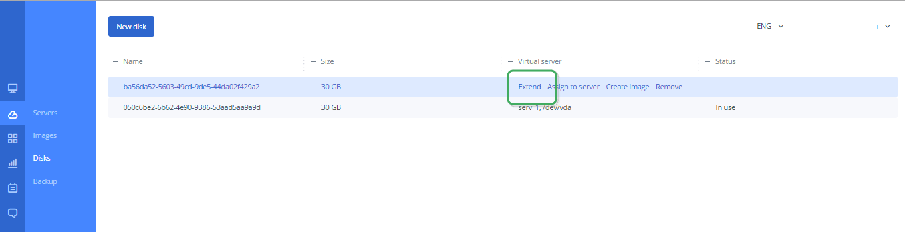

==================
Skyline User Guide
==================

The Guide provides operation information of the Skyline within
the Personal Cloud Account.

.. contents:: Contents
   :depth: 3

1. Start Working
------------------
After **My Cloud** menu is selected, the Skyline **Main Page** automatically
opens.

.. note::

      To activate your Skyline account, you need to follow the link in the additional message when you registered your Cloud Personal Account.

The **Main page** (Figure 1) contains the following UI elements:

1. **Sidebar**:

* Servers;
* Images;
* Disks;
* Backup.

2. **Info unit** that displays additional functionality depending on
the selected menu item;

3. An **auxiliary form** that displays additional content that depends on the
selected menu item.

   Figure 1. Main page

2. Servers
---------------------
The chapter describes operations on the virtual machines, their station
as well as a new machine creation and processing.

2.1. Creating Server
++++++++++++++++++++
In the side bar, select the **Servers** menu. In the top left corner click on
the **Create server** button.

A form to create a new server opens. Enter the required information
in **Name**, **Size**, **Source**, **Image** fields, click on
the **Create Server** button (Figure 2).

.. note::

     All fields marked with an asterisk (*) are required.

.. note::

     It takes a few minutes to create a new server.

   Figure 2. New server

2.2. Password Creation
++++++++++++++++++++++++
In the side bar, select the **Servers** menu. In the top left corner click on
the **Create server** button.

A form to create a new server opens. Select the type of authorization and
enter the pass length. Click on the **Create password** button (Figure 3).

   Figure 3. Password creation

2.3. Stop/ Pause/ Start Server
++++++++++++++++++++++++++++++++++++++++
In the side bar, select the **Servers** menu. Click on the string with
the server name in the table. The string shows more options. Click on
the required icon (Figure 4).

   Figure 4. Stop/ Pause/ Start server

2.4. Deleting Server
+++++++++++++++++++++++++++++
In the side bar, select the **Servers** menu. Click on the string with
the server name in the table. The string shows more options. Click on
the required icon (Figure 5).

.. figure:: images/deleteserver.png
   :align: center
   :width: 800 px
   :height: 400 px

   Figure 5. Deleting server

2.5. Creating Server Image
+++++++++++++++++++++++++++++
.. note::

	 You can create the new server after disks have assigned to the server. Otherwise, you can not create a disk image.

In the side bar, select the **Servers** menu. Click on the string with
the server name in the table. The string shows more options. Click
the **Create a copy** link in the **Image** column (Figure 6).

.. figure:: images/createimage.png
   :align: center
   :width: 800 px
   :height: 400 px

   Figure 6. Creating server image

2.6. Editing Server
++++++++++++++++++++
In the side bar, select the **Servers** menu. Click on the string with
the server name in the table. The string shows more options. Click
the **Settings** link in the **Status** column (Figure 7).

The **Settings** page opens. Edit the information in **Title / Size** fields
and click on the **Edit** button.

   Figure 7. Editing server

2.7. Attaching/Dettaching Disk
++++++++++++++++++++++++++++++++++++++++
In the side bar, select the **Servers** menu. Click on the string with the
server name in the table. The string shows more options. Click the **Settings**
linkin the **Status** column.

The **Settings** page opens. In the **Disks** form select from the drop-down
list the disk and click on the **Attach disk** button (Figure 8).

To detach the disk click **X** in the disk field.

.. figure:: images/settings2.png
   :align: center
   :width: 800 px
   :height: 300 px

   Figure 8. Attaching server

2.8. Backup schedule
++++++++++++++++++++++++++++++++++++++
In the side bar, select the **Servers** menu. Click on the string with
the server name in the table. The string shows more options. Click
the **Settings** link in the **Status** column.

The **Settings** page opens. In the **Backup schedule** form select the time
and frequency. Click on the **Plan** button (Figure 9).

   Figure 9. Backup schedule

3. Images
----------
The chapter describes images of servers to install operational systems.

3.1. Uploading Image
+++++++++++++++++++++
In the side bar, select the **Images** menu. The page shows all server images
available.

In the top left corner click on the **Upload a new image** button. Enter the
required information and click on the **Upload a new image** button (Figure 10).

   Figure 10. Uploading Image

3.2. Deleting Image
++++++++++++++++++++++++++++++++++++++
In the side bar, select the **Images** menu. The page shows all server images
available.

Click on the string with the image name in the table. The string shows more
options. Click the **Remove** link in the Size column (Figure 11).

   Figure 11. Deleting image

4. Disks
--------
The chapter provides the information about disks, including disk size,
location as well as assigning to virtual machines.

4.1. Creating Disks
++++++++++++++++++++++++++++++++++
In the side bar, select the **Disks** menu. The page shows all disks available.

In the top left corner click on the **New disk** button. Enter the
required information and click on the **New disk** button (Figure 12).

   Figure 12. Creating disk

4.2. Disk Extension
++++++++++++++++++++++++++++++++++++
In the side bar, select the **Disks** menu. The page shows all disks available.

Click on the string with the disk name in the table. The string shows more
options. Click the **Extend** link in the **Virtual server** column (Figure 13).

   Figure 13. Extend disk

4.3. Disk Removal
+++++++++++++++++++++++
In the side bar, select the **Disks** menu. The page shows all disks available.

Click on the string with the disk name in the table. The string shows more
options. Click the **Remove** link in the **Virtual server** column (Figure 14).

.. note::

     You can remove the disk only if the disk is in the "Used" status.

.. figure:: images/removedisk.png
   :align: center
   :width: 800 px
   :height: 200 px

   Figure 14. Remove disk

4.4. Assign Disk To Server
+++++++++++++++++++++++++++++
In the side bar, select the **Disks** menu. The page shows all disks
available.

Click on the string with the disk name in the table. The string shows more
options. Click the **Assigh to server** link in the **Virtual server** column (Figure 15).

.. figure:: images/assigntoserver.png
   :align: center
   :width: 800 px
   :height: 250 px

   Figure 15. Assign disk to the server

5. Backup
-------------
In the side bar, select the **Backup** menu. The page shows all backups
created.

Here you can remove or start servers snapshots (Figure 16).

.. figure:: images/backup.png
   :align: center
   :width: 800 px
   :height: 400 px

   Figure 16. Backups

