=====================
User Personal Account
=====================

The Guide provides information about the User Personal Account during a trial
and operational period.

The User Personal Account is a user space that includes a cloud web-interface,
 which enables users to:

* manage all user Cloud resources (servers, drives, IP addresses, etc.);
* control your cloud account balance and funds;
* analyze your costs for cloud services;
* refill your balance via your credit card;
* create requests and communicate with the support team.

.. contents:: Contents
   :depth: 3

Glossary

 .. table::

    ===================  ===================================================
    Term                 Description
    ===================  ===================================================
    Administrator         An employee who has access to the Billing System.
    User                  The Cloud customer who signed the
                          Cloud Resources Agreement.

    Plan                  A set of cloud services that are offered at
                          defined prices.

    Cervice               Cloud resources that the Customer uses and for which
                          the Cloud Services Provider charges the Customer.

    Cloud                 The commercial cloud platform (Cloud) is a hardware /
                          software system, which provides Customers with a set of cloud services as IaaS (Infrastructure as a Service).

    Trial period          Time period during which cloud services are offered free of charge so that the Customer can test and evaluate the cloud resources.

    Operational period    Time period during which the Customer pays for the Cloud services on a regular basis.
    ===================  ===================================================

1. Start Working
---------------------
1.1.	Registration
+++++++++++++++++++++
Open the **Cloud Personal Account authorization page**, select
the Registration tab. Enter the required information, check the **I have read
and agree to the Terms and Conditions** box, check the **I agree that my
personal data will be processed** box. If you do not check these boxes,
the **Continue** button stays disabled. Confirm that you are a human by
checking the **I’m not a robot** box (Figure 1).

.. figure:: images/registration.png
   :align: center
   :width: 500 px
   :height: 700 px

   Figure 1. Registration

.. note::

      If the System does not track any activity within 2 minutes,
      the System will require a recertification.

Click on the **Continue** button.

A new Personal account has been successfully registered. A confirmation email
is sent to the indicated email address. If you have not received the email,
please click on the **Send a confirmation email again** button or contact
the Administrator. Otherwise, your account will stay inactive. Follow
the link in the registration email to activate your Personal account.

1.2. Selecting User Interface Language
++++++++++++++++++++++++++++++++++++++++++
In the top right corner of the page, click on the user name and click on
the language icon. Select the necessary language in the drop-down menu
(Figure 2).

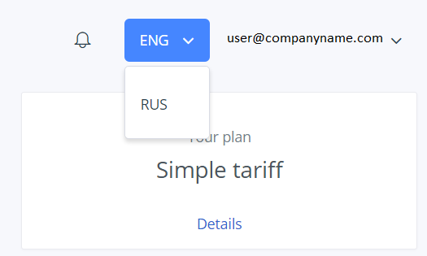

   Figure 2. Intarface language

1.3. User Sign In / Sign Out
++++++++++++++++++++++++++++++++++++++++++

Open the **Personal Account authorization page**, select the **Sign in** tab.
Enter your login and password and click on the **Sign in** button (Figure 3-3.1).

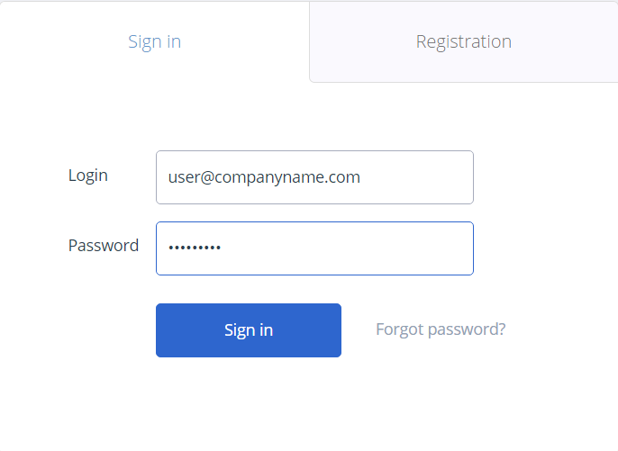

   Figure 3. Sign in

To sign out, click on the user name in the upper right corner of the page,
and select the **Sign out** option.

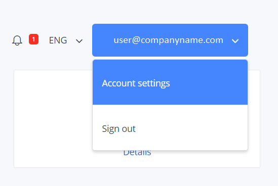

   Figure 3.1. Sign out

1.4. User Password Recovery
++++++++++++++++++++++++++++++++++++++++++

Open the **Cloud Personal Account authorization page**, select the **Sign in**
tab. In the lower part of the form, find the **Forgot password?** link and
click it (Figure 4).

A password recovery window appears. Enter your email address in the dialog
window and click on the **Send button**. The system will send a corresponding
email to the specified email address.

.. figure:: images/passrecovery.png
   :align: center
   :width: 500 px
   :height: 350 px

   Figure 4. Password recovery

1.5.	Setting Private Person / Legal Entity (Company) Account
+++++++++++++++++++++++++++++++++++++++++++++++++++++++++++++++

After the registration is completed, all users are able to evaluate Cloud
resources without indicating if they are private persons or legal entities.
Before the Operational period starts, the user has to indicate the necessary
category.

Open the **Main page** in the Cloud Personal account. In the **Account
balance** field, click the **Become customer** link to start
the operational period (Figure 5).

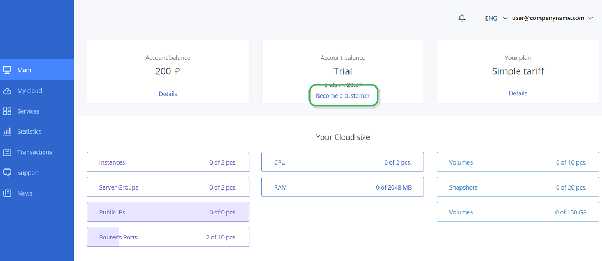

   Figure 5. Become a customer

If you are a **private person**, please do the following:

* Fill in the form with the necessary data and click on the **Continue**
  button (Figure 6).

.. figure:: images/privateperson.png
   :align: center
   :width: 800 px
   :height: 400 px

   Figure 6. Private Person form

If you are a **legal entity (company)**, please do the following:

* Fill in the form with the necessary data and click on the **Continue**
  button (Figure 7).
* A page opens where you can generate the necessary payment documents.
  You can download the documents by clicking on the **Download** button.

After the first payment is made, the legal entity (company) is automatically
switched to the operational period.

.. figure:: images/entity.png
   :align: center
   :width: 800 px
   :height: 400 px

   Figure 7. Legal Entity form

2. User Account Settings
------------------------

Click the user name in the top right corner of the page and select
the **Account Settings** option in the dropdown list (Figure 8).

   Figure 8. Assount settings

An auxiliary form to edit user account settings opens (Figure 9).

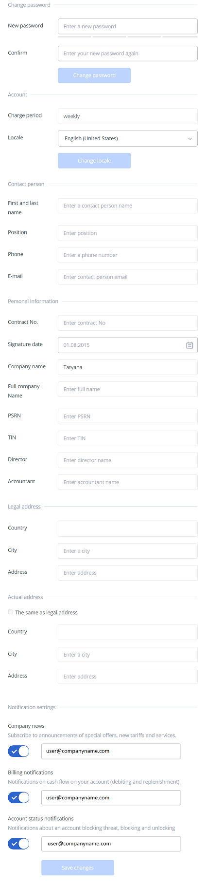

   Figure 9. Settings form

2.1. Change User Password
++++++++++++++++++++++++++++++++++++++++++

Click the user name in the upper right corner of the page and select the
**Account Settings** option in the dropdown list. Fill in the fields in
the **Reset Password** section and click on the **Change password** button
(Figure 10).

.. note::
         To prevent your passwords from being hacked, we recommend that you to use a password that includes at least six symbols including  characters (upper and lower case) as well as digits.

.. figure:: images/changepass.png
   :align: center
   :width: 600 px
   :height: 200 px

   Figure 10. Change user password

2.2. Notification Settings
++++++++++++++++++++++++++++++++++++++++++
Click the user name in the upper right corner of the page. In the drop-down
menu, select the **Account settings** option. To subscribe / unsubscribe from
various notifications, find the **Notification settings** on the page and move
sliders to a desired position. Click on the **Save changes button**
(Figure 11).

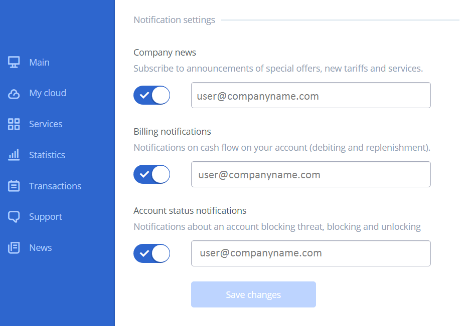

   Figure 11. Change user password

2.3. Add Funds for Private Persons
+++++++++++++++++++++++++++++++++++++++++++++++++++++++++++++++
Open the **Main page** in the Cloud Personal account.In the top right corner
of the page, click on the user name and select the **Add funds** option.
Or select the **Main item** in the sidebar menu and click on the **Add funds**
link in the **Account balance** section (Figure 12).

.. figure:: images/replenishment.png
   :align: center
   :width: 800 px
   :height: 360 px

   Figure 12. Add funds

A page opens where you need to enter the amount of funds that you plan to add
to your Cloud account. Click on the **Make payment** button.

A special form opens where you need to enter your credit card details, specify
your email address if you want the Billing system to send you an electronic
receipt and click on the **Make payment of…** button (Figure 13).

.. figure:: images/addfunds.png
   :align: center
   :width: 800 px
   :height: 400 px

   Figure 13. Card payment

2.4. Generating Documents for Payment by Legal Entities and Companies
+++++++++++++++++++++++++++++++++++++++++++++++++++++++++++++++++++++++++++
In the upper right corner of the page, click on the user name and select
the **Invoice and bill** option. Or select the **Main item** in the sidebar
menu and click on the **Остаток на счете** link in the **Account balance**
section.

A form to generate invoices and bills opens. Select a time period and
the documents format (PDF or Excel) and click on the **Create a report**
button. A document in the selected format will be downloaded.

2.5. Automation Payment Settings
++++++++++++++++++++++++++++++++++++++++++
Click the user name in the upper right corner of the page. In the drop-down
menu, select the **Account settings** option. Select the limit and the sum
of the widrawal in the **Auto payment** section and click on the **Save**
button (Figure 14).

.. figure:: images/autopayment.png
   :align: center
   :width: 800 px
   :height: 350 px

   Figure 14. Autopayment

2.6. Changing the Locale
+++++++++++++++++++++++++++
Click the user name in the upper right corner of the page. In the drop-down
menu, select the **Account settings** option. Select tha period of charge and
locale in the **Account** section and click on the **Change locale**
button (Figure 15).

.. figure:: images/locale.png
   :align: center
   :width: 800 px
   :height: 300 px

   Figure 15. Changing the locale

2.7. Changing Contact Data
++++++++++++++++++++++++++++++++++++++++++
In the top right corner of the page, click on the user name and select
the **Account settings** option. In the Personal information section, change
the necessary data and click on the **Change data** button below (Figure 9).

3. Personal Account Overview
----------------------------
The chapter describes the main UI items and functionality that the Billing
system provides to private persons and companies (Figure 16).

The **Main page** contains the following UI elements:

1. **Sidebar**:

* Main;
* My Cloud;
* Services;
* Statistics;
* Transactions;
* Support;
* News.

2. **Info unit** that displays additional functionality depending on
the selected menu item;
3. An **auxiliary form** that displays additional content that depends on the
selected menu item.

   Figure 16. Main page

4. My Cloud
----------------------------
In the side bar, select the **My Cloud** / **Skyline**  menu. A page that displays
the OpenStack Horizon/Skyline web dashboard opens. For detailed user guide on
working with the OpenStack Horizon web dashboard, please see **OpenStack
Horizon User Guide** \ **Skyline User Guide** (Figure 17-18).

.. note::

      To activate your Skyline\OpenStack Horizon account, you need to follow the link in the additional message when you registered your Cloud Personal Account.

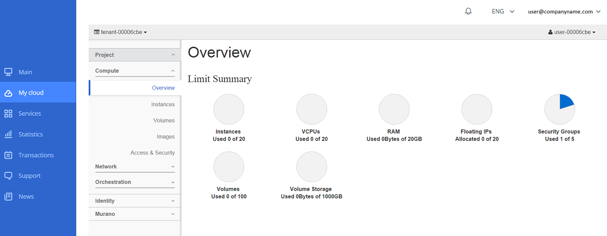

   Figure 17. Openstack console

.. figure:: images/skyline.png
   :align: center
   :width: 800 px
   :height: 300 px

   Figure 18. Skyline console

5. Services List
----------------------------
In the sidebar, select the **Services menu**. A page opens that displays
the Services included in your current plan table (Figure 19).

To change a list of services, please contact the Administrator of
the Billing system.

.. figure:: images/services.png
   :align: center
   :width: 800 px
   :height: 400 px

   Figure 19. Services

6. Statistics
----------------------------
In the sidebar menu, select the **Statistics** item. The table displays all
Cloud resources that were used. To view resources statistics for a certain
time period, click a corresponding link (**Week, 2 weeks, Month, Year**)
in the right part of the page (Figure 20).

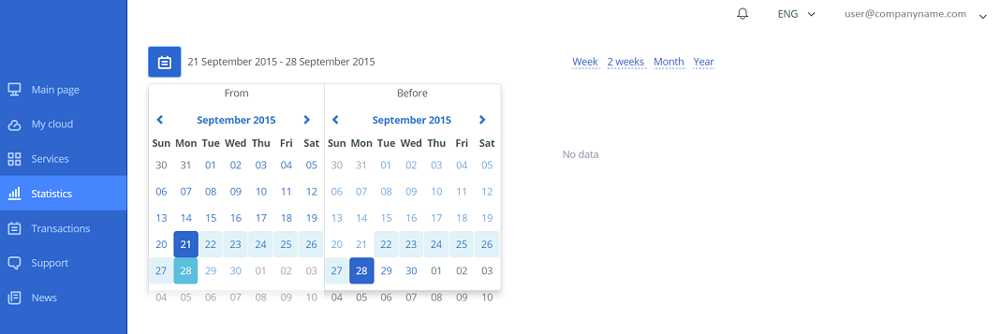

   Figure 20. Statistics

To customize the time period, click on the calendar icon in left part of
the page. In the displayed calendar windows, select the necessary time period.
The table will automatically update and show transactions history.

You can generate a statistics report in various formats. To request a report,
click on the drop-down list and select the necessary format option
(Excel, PDF, TSV), then click on the **Request report** button (Figure 21).

.. figure:: images/services2.png
   :align: center
   :width: 800 px
   :height: 300 px

   Figure 21. Report

7. Transactions
----------------------------
In the sidebar menu, select the **Transactions** item. A page opens that
displays a list of the latest transactions. To view transactions history for
a certain time period, select a corresponding link (**Week, 2 weeks, Month,
Year**) in the right part of the page (Figure 22).

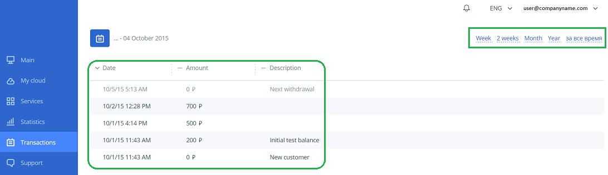

   Figure 22. Transactions

To customize the time period, click on the calendar icon in left part
of the page. In the displayed calendar windows, select the necessary time
period. The table will automatically update and show transactions history
(Figure 23).

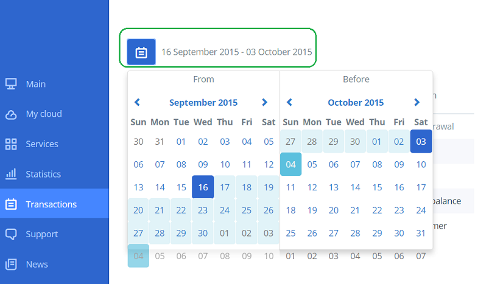

   Figure 23. Transactions history

8. Support
----------------------------
In the side bar, select the **Support** option. A tech support form opens
that contains the following fields:

* **Subject** dropdown list - select the question category;
* **Send copy** - enter additional email addresses;
* **Your email** – displays your current email address that you use to log
  into your Personal account;
* **Message** - enter additional information if necessary.

Click on the **Send message** button to send a request to the technical
support team (Figure 24).

.. figure:: images/support.png
   :align: center
   :width: 800 px
   :height: 200 px

   Figure 24. Support form

9. News
----------------------------
In the sidebar, select the **News** menu. The page lists all the company news.
To view a full text of the news, click the link **Read more…** at the end
of the article (Figure 25).

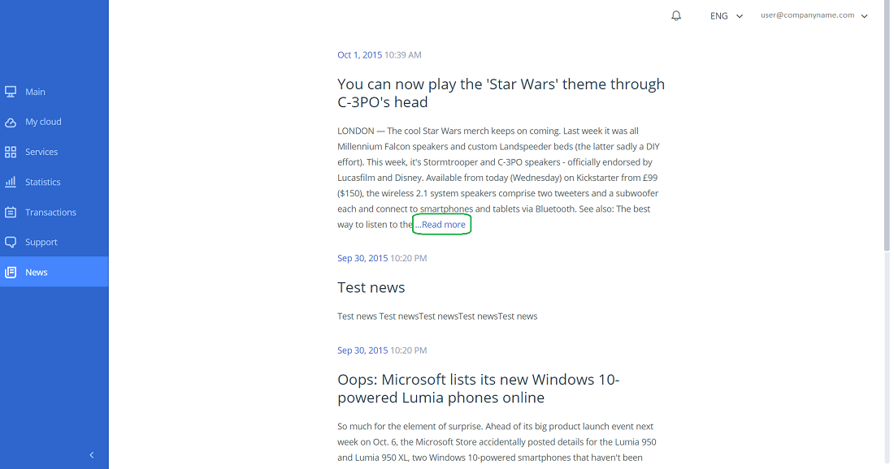

   Figure 25. News
